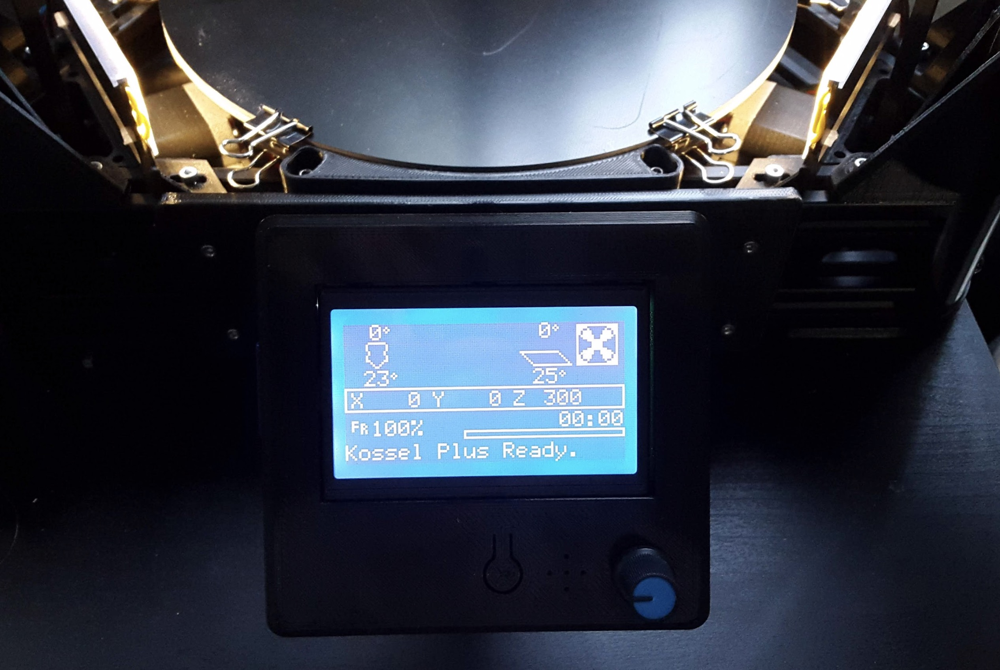
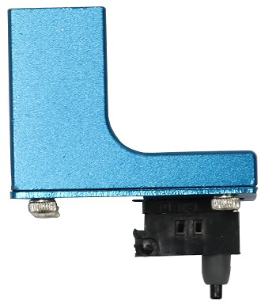
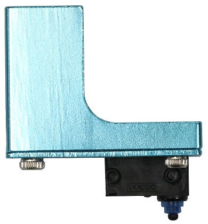

# Readme

# Current Marlin Version: 2.0.5.3

These configurations activate many of the new advanced features of the Marlin firmware:

 * Auto Calibration
 * S-Curve Acceleration
 * Babystepping while printing (double click on control knob)
 * Unified Bed Leveling (UBL)
 * Manual Mesh Edit via LCD
 * Full LCD 12864 Full Graphic Smart Controller Support
 * Progress Bar support for 2004 and 12864 LCD
 * Pause & Filament Change

...and Games! (click below)

**Note** If you want to use the old 2004-Style LCD, which comes with the printer out of the box, just comment `#define REPRAP_DISCOUNT_FULL_GRAPHIC_SMART_CONTROLLER` out and uncomment `#define REPRAP_DISCOUNT_SMART_CONTROLLER` in `configuration.h`.

**Important**: Before doing anything else after updating the firmware, go to `Configuration > Advanced Settings > Initialize EEPROM` to get rid of old configurations.

Then you should execute `Configuration > Delta Configuration > Probe Z-offset` to verify the Probe offset.

After that you should connect the Z-Probe and start `Configuration > Delta Calibration > Auto Calibration`. The Settings are automatically stored inside your EEPROM.

You should also do a `Motion > Unified Bed Leveling > Step by Step bed leveling` followed by `Store Settings` to ensure a perfect leveling.

Please do a manual paper test (moving the nozzle slowly down to Z0 and checking with a piece of paper). If it's not perfect, use `Configuration > Advanced Settings > Probe Z Offset` to correct the difference and execute the calibration again.

# Select the Configuration

**Please select the correct values at the start of the Configuration.h file**

The Kossel comes in 3 versions:

 * Pulley
 * Linear
 * Linear Plus

Pulley and Linear use the same configuration, the Linear Plus is bigger and uses slightly different configurations.

Typically the probes for the Anycubic Delta Kossel printers come in two different versions.

  * Version 1: Z Probe Offset of -19.0mm

    

  * Version 2: Z Probe Offset of -16.2mm

    

If you select the `ANYCUBIC_PROBE_VERSION 0`: It's very important to follow the correct procedure to set it up after flashing the firmware, otherwise you might damage the printer by ramming the nozzle into the heatbed:

* `Configuration > Advanced Settings > Initialize EEPROM`
* `Motion > Move Axis > Soft Endstops` : `Off`
* Auto Home and slowly move the nozzle down until it barely touches the bed. (Do a paper-test: A normal sheet of paper should just feel the drag of the nozzle) and note this number.
* Subtract this number from the value in `Configuration > Delta Calibration > Delta Settings > Height`. (If it's negative, add it).
* Save and try the paper test again to verify your height.
* `Configuration > Store Settings`
* `Motion > Unified Bed Leveling (UBL) > Manual Mesh Bed Leveling`

# Download

You can download binary releases from the releases page, which can be found here: https://github.com/knutwurst/Marlin-2-0-x-Anycubic-Kossel-Linear-Plus/releases. Of course you can also build the firmware by yourself using PlatformIO or Arduino IDE.

-> `Kossel_Plus_2053.hex` is for the unmodified original Anycubic Kossel Linear Plus.

-> `Kossel_Plus_2053_TMC.hex` has optimisations and also inverted outputs for TMC2100 and TMC2208 Stepper drivers.

-> `Kossel_Plus_2053_Graphic_LCD.hex` is used, when you changed your LCD from the original 2004-Style to a
12864 Full Graphic Smart Controller.

-> `Kossel_Plus_2053_TMC_Graphic_LCD.hex` is used if you have everything. New 12864 Full Graphic Smart Controller and also quiet TMC Stepper Drivers.
